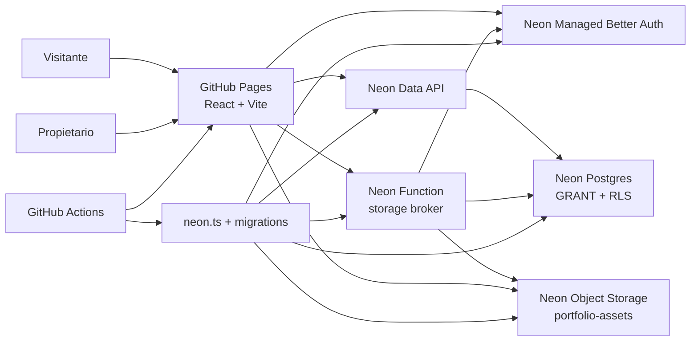

# Arquitectura

## Objetivo

Mantener un portfolio público rápido y estático, con una zona de propietario capaz de editar contenido sin alojar secretos en GitHub Pages. GitHub contiene todo lo reproducible; Neon conserva datos y archivos reales.

## Responsabilidades

- **GitHub Pages:** entrega únicamente `dist/`; no ejecuta backend ni guarda secretos.
- **Frontend:** presenta el contenido en un tablero de corcho con pan/zoom y secciones expandibles; muestra fixtures cuando no hay backend y, con Neon, consulta contenido y gestiona sesión.
- **Auth:** crea sesiones/JWT. Autenticarse no equivale a ser propietario.
- **Data API:** convierte consultas del SDK en operaciones Postgres y selecciona rol por JWT.
- **Postgres:** es la autoridad de permisos mediante roles, allowlist y RLS.
- **Storage broker:** verifica JWT EdDSA/JWKS y allowlist, limita formatos/tamaño y firma operaciones S3 breves.
- **Object Storage:** guarda bytes; `assets` guarda identidad, rutas y metadatos.
- **Actions:** valida cada cambio, despliega Pages y ofrece provisión Neon controlada.

## Flujos

### Lectura pública

El cliente anónimo obtiene un token anónimo de Neon; Data API usa el rol `anonymous`. Las políticas exponen entradas `published` no borradas, sus bloques y settings públicos. Las URLs de imágenes publicadas viajan en los bloques; la tabla `assets` no se expone al visitante.

### Propietario

Better Auth crea la sesión. `public.is_owner()` cruza `auth.user_id()` con `app_private.owner_accounts`. Solo entonces RLS permite CRUD. Una cuenta registrada fuera de la allowlist no puede escribir.

### Imágenes

Las credenciales S3 existen solo en la Neon Function. El navegador recibe una URL PUT limitada a un objeto, Content-Type y cinco minutos. La lectura es pública porque el portfolio es público; una migración a bucket privado requeriría URLs GET firmadas.

## Compatibilidad con GitHub Pages

No se usan rutas de servidor ni SSR. El modo propietario es `/?owner=1`, de modo que una recarga no depende de un fallback 404. Vite usa base `/` porque el repositorio es una User Page (`aleetreny.github.io`).

## Degradación

Si Neon no está configurado, la build sigue siendo válida y usa `fixtures/demo-content.json`; el modo propietario explica qué falta. Si Neon falla en producción, la UI muestra un error y no sustituye silenciosamente los datos reales por fixtures.

## Fuentes de verdad

- código/configuración: GitHub;
- esquema: `db/migrations/`;
- infraestructura Neon: `neon.ts` + variables seguras;
- datos reales: Neon Postgres;
- bytes: Neon Object Storage;
- estado del proyecto: `PROJECT_STATUS.md` y `docs/handoff.md`.
