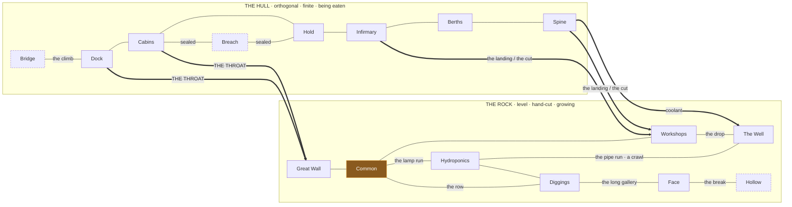

# The skeleton: the habitat as a plan

Layout specification, phase one. Branch: `night-shift-habitat`.

This document settles **where everything is** and **what the spaces between rooms
are**. It does not cover interiors, furniture, clutter, palette or implementation.
Those come after, room by room.

It supersedes the placement in `src/lib/habitat/section.ts` and nothing else. The
sixteen rooms of `2026-08-31-habitat-rooms.md` and their twenty-one connections
are canon and are not reopened here.

## Why this exists

`section.ts` places the hull as a perfect ladder — each room hung off the bottom
edge of the one before it, stepped sideways by `tan(22°)` — and the rock as eight
rectangles at hand-picked coordinates. Everything is rectangular, everything is
aligned, and the passages between rooms are drawn as lines rather than existing as
space. That is a bubble diagram.

It also draws the world as a **side section** while the rooms are drawn **from
above**. Two projections, so the design's central claim — one world at two
magnifications — is already false in the code.

## The four decisions

1. **One projection: a top-down plan.** The map and the room interiors are the
   same view at two scales. The twenty-two degrees stop being vertical and are
   expressed *inside* the plan, as ramps, cleated floors, handrails on the
   downhill side, and loose things pooled against the aft wall of every hull room.
2. **Corridors are places.** Eleven connective spaces get names, grids, clutter
   and minimap labels. Walking is a real cost and the long way round is a real
   choice.
3. **The hull stays rigid but is visibly cannibalised.** Its geometry does not
   yield — every hull wall is at 0° or 90° — but its fabric is being carried away.
4. **A fixed, generous frame with virgin rock in it.** Day one hundred occupies
   about forty per cent of the frame. The rest is stone the warren will grow into,
   and the map's east and south-east edges are deliberately unfinished.

---

## The zones

| Zone | Rooms | Character |
| --- | --- | --- |
| **The bow** | Bridge, Dock | Cold, exposed, ceremonial. A dead end. |
| **The buried hull** | Cabins, Breach, Hold, Infirmary, Berths | Orthogonal, repetitive, downhill. Metal, and going. |
| **The keel** | Spine | The other axis. Hot. Descended, not walked. |
| **The public warren** | Great Wall, Common, Hydroponics, Workshops | Level, irregular, warm. High traffic. |
| **Home and frontier** | Diggings, Well, Face, Hollow | Domestic, filthy, dark, unfinished. |

**No rooms are added.** Sixteen is the right number and each one has closed lore.

## The eleven connective spaces

The reference minimap that started this has more named callouts than rooms — the
corridors have names. That is what turns a floor plan into a place, and it is what
this habitat has been missing.

| Name | Joins | What it is | Width |
| --- | --- | --- | --- |
| **The Climb** | Bridge ↔ Dock | A steep ladder-and-step run. Nothing above it but the Bridge. | 1.5 m |
| **The Long Walk** | the length of the hull | The ship's corridor. Straight, metal, downhill the whole way, and it runs *through* the Cabins, so you pass every door every day. | 3 m, bitten out to 5 |
| **The Throat** | Dock/Cabins ↔ Great Wall | The ramp from hull to rock. Widest passage in the habitat, and the only lit one. Official. Everybody. | 6 m → 4 m |
| **The Landing** | Infirmary + Spine head + The Cut | The rough chamber the workshop people made when they broke into the ship. Three mouths, no plan. | 8 × 6 m |
| **The Cut** | The Landing ↔ Workshops | Low, rough, unlit, cut too small. You duck the whole way. Unofficial: they made it so they would not have to walk round. | 1.8 m wide, 1.6 m high |
| **The Lamp Run** | Common ↔ Hydroponics | The only warm corridor, because it catches the grow-lamp spill. People loiter here without saying they are loitering. | 2.5 m |
| **The Row** | through the Diggings | Nine front doors facing each other. Everyone sees who goes into whose. | 3 m |
| **The Drop** | Workshops ↔ Well | Wet, grated, steep. | 2 m |
| **The Pipe Run** | Well ↔ Hydroponics | A crawl, single file, following the water line **under the floor of the Common**. | 0.9 m |
| **The Long Gallery** | Diggings ↔ Face | The commute to the frontier. Long, unfinished, dark at the far end. | 2.5 m → 1.8 m |
| **The Break** | Face ↔ Hollow | A torn hole, not a doorway. | ~2 m, irregular |

## The two crossings

Today there are five hull↔rock links spread across the map, which makes the two
halves read as merged. They are unchanged, but they are **grouped into two
crossing regions with opposite characters**, and drawn that way.

- **The Throat** — high, wide, ramped, lit, carries two links. Cut on purpose,
  early, by everybody. **Here you are seen.**
- **The Landing / The Cut** — deep, low, dark, carries three links, and is a messy
  interpenetration rather than a door: the workshops chewed into the ship's belly
  and the rock is inside the hull there. **Here you are not.**

The habitat touches the ship in exactly two places and they mean opposite things.

---

## The plan

```
   ·  ·  ·  ·  ·  ·  vacuum · stars · regolith  ·  ·  ·  ·  ·  ·  ·  ·  ·  ·  ·
 ═══════════════════════════════════════════════════════════════ surface ══════

   THE HULL                                    THE WARREN
   inherited · orthogonal · being eaten        cut by hand · irregular · growing
   ─────────────────────────────────────       ───────────────────────────────────

            BRIDGE  ·· dead end · intact                      HYDROPONICS
              ┊  the climb                                     warm · the only light
             DOCK ──X──► outside                                    ┊  the lamp run
              ┊                                                     ┊
              ┊  the long walk                                      ┊
         C A B I N S ══ THE THROAT ══►  GREAT WALL ══ C O M M O N ══ DIGGINGS
              ┊ ╲       wide·ramped·lit    the lobby     THE HUB      the row
              ┊  BREACH ·· vacuum · no witness · two sealed ways        ┊
              ┊ ╱                                          ┊      the long gallery
            HOLD                                           ┊           ┊
              ┊                                            ┊         FACE ►► grows
        INFIRMARY ┐                                        ┊           ╎ the break
              ┊   ├ THE LANDING ══ the cut ═════════ WORKSHOPS      HOLLOW
           BERTHS │   low · rough · unlit              the economy  unassigned
           intact │                                        ┊  the drop
              ┊   │                                   THE WELL          ·  ·  ·
            SPINE ┘                                        ┊         unmapped rock
           a shaft ══════════ coolant ═════════════════════┘

        ┈┈┈ the pipe run:  THE WELL ┈┈ under the COMMON's floor ┈┈ HYDROPONICS ┈┈┈
             a crawl · single file · there is a grating in the Common
```

Topology, with the corridors as named edges:



---

## Why each zone is where it is

**The Common at the centre, four mouths at four corners.** Degree four, and it is
*crossed*, not entered: every pair of mouths gives a different traverse, some
passing hard by the long table and some skirting the wall. The difference between
being seen and not being seen is two metres inside one room, and the engine reads
that straight off the grid.

**The Diggings behind the Common.** Going home means crossing the room everybody
is in. Domestic life is made public by geometry rather than by a rule.

**Hydroponics as a destination, not a thoroughfare.** It hangs off the Common by
one corridor and leads nowhere useful but the crawl. You go on purpose. That is
what makes the argument about the lamps legible: whoever went only to sit made a
trip to do it.

**The Workshops between the Common, the Spine and the Cut.** They need power, hull
scrap and customers, and they sit at the junction of all three. The most contested
resource in the habitat is in a crossroads with an audience.

**The Well at the bottom, and nobody passes through it.** Water runs downhill, and
because the Well is on the way to nothing, Osvald's power is invisible by layout.

**The Berths behind the Infirmary.** To reach hundreds of sleepers you walk through
the room where the dead are laid out. That corridor means something.

**The Breach with two mouths, both sealed.** Real privacy needs two exits: being
seen going in does not tell anyone where you came out.

**The Bridge and the Hollow, the two extremes.** The two furthest points from the
Common, the two dead ends, the two places you only go for one reason.

### Three facts already in the data that this plan underlines instead of smoothing

1. **There are exactly three cut vertices: Dock, Diggings, Face.** To reach the
   Bridge you must pass the Dock — the romantic room is behind the bureaucratic
   one, past the outing list. **To reach the frontier you must walk The Row**, past
   nine front doors. Yara slipping off to the Face to carve goes past everyone's
   home to get there.
2. **There is a route that avoids the Common** — Diggings → Hydroponics → the pipe
   run → Well → Workshops → the ship. It is a crawl along a water pipe. The price
   of being seen by nobody is being seen by exactly one person: the one whose work
   nobody acknowledges.
3. **That pipe passes under the Common.** There is a grating in the floor of the
   most public room in the habitat. Whoever is crawling hears the whole room;
   whoever is eating hears the crawl. This falls out of the existing graph for
   free and it is the best thing on the map.

---

## Rules for irregularity

Every crooked thing has a cause. None of it is noise.

1. **Angular drift with distance from the ship.** Near the Throat the tunnels
   still run roughly parallel to the hull, because the first diggers followed it
   without deciding to. The further out, the more the geometry comes loose, until
   nothing at the Face is aligned with anything. One rule, generative, and it
   reads as history.
2. **No rock room is entered head-on.** Mouths land in corners or off-axis: you
   come in at the edge and see the room obliquely.
3. **No rock corridor runs straight for more than about eight metres.** It doglegs
   around hard stone.
4. **No two rock chambers share a wall angle.** Their walls follow where the stone
   gave way.
5. **Three anchor mistakes, all already in the lore.** A chamber cut too big (the
   Great Wall), a passage cut too low (the Cut), a void nobody planned (the
   Hollow). Everything else crooked hangs off those three.

## Cannibalisation: the hull's fabric

The hull's *plan* does not bend. Its *material* is leaving. This is the decision
that makes the ship read as adapted and reused rather than merely inherited.

- **A looting gradient with a direction.** The hull is most stripped near the
  Throat and the Cut, where the mass is easy to carry out, and most intact at the
  bow and in the Berths — far, or taboo. The texture of the map has a direction,
  and you can see where the axe went in.
- **The Long Walk is not a constant width.** It has bites taken out of it where
  plate was lifted.
- **Rock shoring inside the ship.** Where too much was taken, stone props have
  been driven in from outside. The two grammars touch *inside* the hull.
- **The long table is a hull plate**, so somewhere in the hull there is a
  table-shaped hole. It is drawable and it should be drawn.
- **Proposal, not yet settled: stripped bulkheads give sightlines, not routes.**
  A new terrain character (`%`) for a bulkhead whose plate has been taken: solid
  to walking, open to sight and sound. It adds no edges, so `rooms.test.ts` is
  unaffected, but it gives the simulation partial observation — you can hear the
  next room without being in it. Flagged because it touches the encoding, which is
  load-bearing.

## Frame and growth

- Day-one-hundred footprint is roughly **165 × 85 tiles**, hull and warren and
  corridors together.
- The frame is **about 260 × 150 tiles**, so the habitat occupies around forty per
  cent of it.
- The empty stone is to the **east and south-east**, beyond the Face and around the
  Hollow, which is the direction the warren grows.
- The rock runs off the frame on three sides. The east edge is left ragged on
  purpose: the map is a piece of something bigger.
- The minimap never recomposes. Growth reads as advance, and the observer keeps
  their mental map.

## What this changes in `section.ts`

For later, recorded now so it is not rediscovered:

- `HULL_ORDER` stacking by `tan(TILT)` goes. The hull becomes an orthogonal plan
  with the Long Walk as its armature.
- `ROCK_AT` hand-picked coordinates go. Rock rooms are irregular polygons placed
  by the drift rule.
- `LINKS` stops being a list of lines and becomes the eleven connective spaces,
  each with its own grid.
- `FRAME`, `asteroidOutline`, `craters` and `facets` rescale to the new frame.
- `TILT` stops being a render transform and becomes floor slope inside hull rooms.

## Deliberately not decided yet

Interiors, furniture, clutter density, palette, lighting, the tile art, how the
minimap labels are typeset, and what a room looks like when somebody is in it.
Those are the next phase, room by room.
